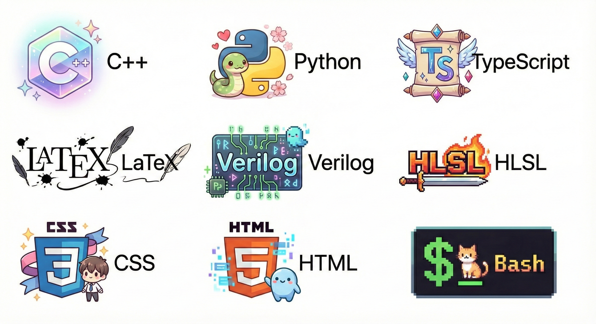

  

## Who am I
A undergraduate student from THU IIIS, learning in AI now. However, I was used to learn physics and became a member of China National Physics Team in 40th CPHO. Please contact me with 📬[email](wuhx24@mails.tsinghua.edu.cn).

## Languages and Tools

  

  
  
  
  
  
  
  
  
  
  
  
  
  
  
  
  

 

## Github Stats  
<table><tr><td valign="top" width="56%">

</td><td valign="top" width="50%">

</td></tr></table>  
